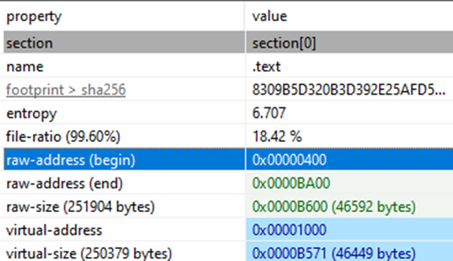

# Reversal and Analysis of Zeus Banking Trojans

Zeus/Zbot is a malware package using a client/server model. Operators of the Zeus malware use it to create massive botnets. Its main function is to gain unauthorized access to financial systems by stealing credentials, banking information and financial data, and sending it back to the attackers via the Zeus Command and Control (C&C) server.

## Contents

### File Fingerprint

- Filename: invoice_2318362983713_823931342io.pdf.exe
- Link: [theZoo](https://github.com/ytisf/theZoo/blob/master/malware/Binaries/ZeusBankingVersion_26Nov2013/ZeusBankingVersion_26Nov2013.pass)
- sha256: 69E966E730557FDE8FD84317CDEF1ECE00A8BB3470C0B58F3231E170168AF169

### Basic Static Analysis

Use to `Pestudio` find sha256 hash code and paste the result into `Virustotal`.

#### Libraries

Use to `Pestudio` find some libraries this trojan used

#### Sizes

checking raw-size and virtual size.

Raw size: The Size of Raw Data how big the section is on disk.  
Virtual size: Virtual Size tells us how much space is allocated for a section during the
loading process.  
if the Virtual Size is much larger than the Size of Raw Data, you know that the section takes
up more space in memory than it does on disk. This is often indicative of packed code.   

#### API calls
Use to `Pestudio` find API was called by this trojan. Some API necessary I will perform.
1. AllowSetForegroundWindow: AllowSetForegroundWindow is a function in the Windows API that’s used for managing which application window is in the foreground, also known as the active window.    
This function is typically used in scenarios where one application might want to temporarily allow another application to take control of the foreground window.
